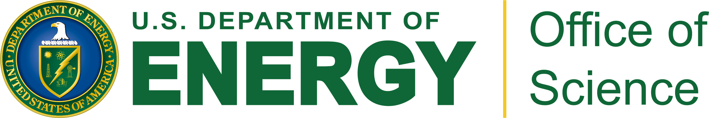

Michael Kagan is a Panofsky Fellow at the SLAC National Accelerator Laboratory at Stanford University. His group focuses on research in Experimental High Energy Physics and Machine Learning applications to science. As a part of ATLAS experiment, his group aims to understand the rare interactions of the Higgs boson, most spicifically the Higgs boson self-interactions, and how it gives mass to other particles. Michael and his team work at the interface of physics and machine learning to develop new methods to better understand and extract insights from the large and complex data generated by the LHC and other experiments in High Energy Physics. Michael holds a Ph. D. in Particle Physics from Harvard University, where he worked under Professor Masahiro Morii, and a B.S. in Physics and in Mathematics from the University of Michigan, where he worked under Professor Dante Amidei.

[Teaching](/teaching/){: .btn .btn--primary} [Talks](/talks/){: .btn .btn--primary} [Conference Organization](/conference-organization/){: .btn .btn--primary}

 

# Funding

I am currently funded by a DOE Early Career Award under Grant DE-AC02-76SF00515, and by the SLAC Panofsky Fellowship.

<figure class="half">
    
    
</figure>

