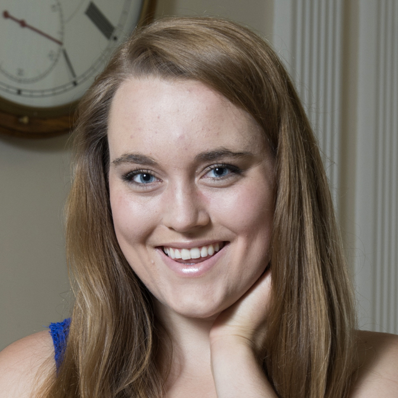
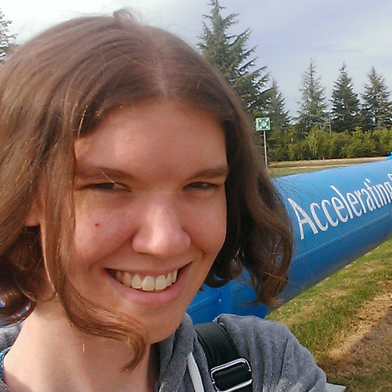
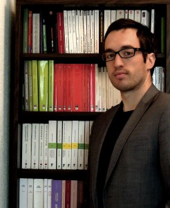

<!-- UIkit CSS -->
<link rel="stylesheet" href="https://cdn.jsdelivr.net/npm/uikit@3.2.6/dist/css/uikit.min.css" />

<!-- UIkit JS -->

## Principle Investigator

    <table class="uk-table uk-table-hover uk-table-middle uk-table-divider">
        <thead>
            <tr>
                <th class="uk-table-shrink"></th>
                <th class="uk-table-expand"></th>
                <th class="uk-table-expand"></th>
            </tr>
        </thead>
        <tbody>
            <tr>
                <td></td>
                <td>Michael Kagan</td>
                <td>Hi! I work on... </td>
            </tr>
        </tbody>  
    </table>
	

## Postdocs

    <table class="uk-table uk-table-hover uk-table-middle uk-table-divider">
        <thead>
            <tr>
                <th class="uk-table-shrink">People</th>
                <th class="uk-table-expand"></th>
                <th class="uk-table-expand">Projects</th>
            </tr>
        </thead>
        <tbody>
            <tr>
                <td></td>
                <td>Rafael Teixeria De Lima</td>
                <td>Higgs Physics, Di-Higgs physics, Boosted Higgs tagging, Bottom quark jet tagging algorithms, Hardware accelerated fast inference for ML</td>
            </tr>
        </tbody>
    </table>
	

## Students

    <table class="uk-table uk-table-hover uk-table-middle uk-table-divider">
        <thead>
            <tr>
                <th class="uk-table-shrink">People</th>
                <th class="uk-table-expand"> </th>
                <th class="uk-table-expand">Projects</th>
            </tr>
        </thead>
        <tbody>
            <tr>
                <td></td>
                <td>Nicole Hartman</td>
                <td>Di-Higgs physics, Bottom quark jet tagging algorithms, Sequential and Set based neural networks for jet tagging and combinatorial optimization </td>
			</tr>
			<tr>
                <td></td>
                <td>Rachel Smith</td>
                <td>Jet triggers and fast calibration, Hardware Accelerated Fast Inference for ML</td>
			</tr>
			<tr>
                <td></td>
                <td>Maxime Vandegar (visiting)</td>
                <td>Likelihood free inference, Measurement decorruption, Invertiable neural networks</td>
            </tr>
        </tbody>
    </table>

## Alumni

    <table class="uk-table uk-table-hover uk-table-middle uk-table-divider">
        <thead>
            <tr>
                <th class="uk-table-shrink"></th>
                <th class="uk-table-expand">People</th>
                <th class="uk-table-expand">Projects</th>
            </tr>
        </thead>
        <tbody>
            <tr>
                <td></td>
                <td>Yoann Boget</td>
                <td>Uncertainty estimation with deep conditional generative models </td>
	</tr>
        </tbody>
    </table>

