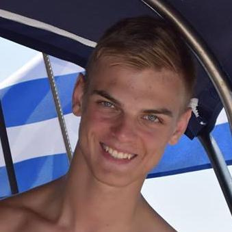

## Principle Investigator

## Postdocs

:----: | :----: | :-----
 | Dr. Rafael Teixeira de Lima |  Higgs Physics, Di-Higgs physics, Boosted Higgs tagging, Bottom Quark jet Tagging
 | Dr. Rachel Hyneman |  Higgs Physics, Di-Higgs physics, Di-Photon Physics, Gaussian Processes

## Students

:----: | :----: | :-----
 | Nicole Hartman |  Di-Higgs physics, Bottom Quark Jet Tagging, Sequential and Set neural networks, Combinatorial Optimization
 | Rachel Smith | Online  Bottom Quark Jet Tagging, Online Beam Spot

## Researchers

:----: | :----: | :-----
 | Maxime Vandegar | Likelihood free inference, Measurement decorruption, Invertiable neural networks
